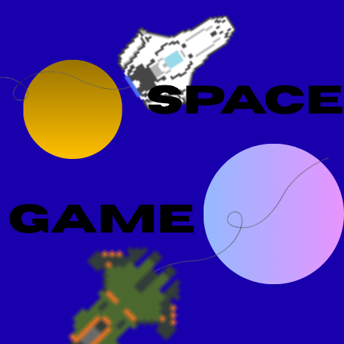

# Space Game

# Présentation Générale
SpaceGame est un jeu d'exploration type RPG où le joueur doit explorer un monde spacial composé de planètes.  
L'objectif était de recréer un jeu en 2D en s'inspirant de nos 2 jeux favoris à l'époque: Star Citizen et Endless Sky.  
L'idée nous est venue bien avant de connaitre le concour Trophées NSI, mais ce dernier nous à permis de nous motiver à le coder.  

## Lore
Le joueur incarne un vaisseau, seul au milieu du vide sidéral de l'espace, ayant pour seul but d'aider ce monde singulier.  
Les planètes sont des êtres à part entière et la raison de votre apparition dans ce monde singulier reste floue.  
Votre objectif principal est d'aider les planètes en complétant leurs quêtes.  
Votre argent ne sert à rien, c'est pourquoi il est appellé d'après le dieu grec de l'Avarice, Phtonos.  
Vous pouvez changer de vaisseau entre les 3 vaisseaux disponibles, afin d'évoluer dans cet univers avec des caractéristiques différentes comme une vitesse ou une maniablité plus ou moins importante.  
Une flèche vous guidera en vous indiquant où vous rendre afin de compléter vos quêtes, et toutes les planètes ont besoin de votre aide.  
L'objectif était de créer un jeu singulier, avec une ambiance dérangeante et sans but particuler.  
Même si il manque 2-3 éléments afin qu'il soit réelement terminé, nous pensons avoir bien réussi ce défi, avec des designs simples, une musique simple et une histoire tout aussi banale.  

# Organisation du travail
Dans un premier temps, Pablo Perez s'est occupé de faire des recherches sur comment faire de la génération procédurale.  
Pendant ce temps, Alexandre Delcamp Enache s'est occupé de faire les menus, ainsi que 2-3 features comme l'option pause.  

Dans un second temps, Alexandre a amélioré le menu avec une sélection de vaisseau plus claire et plus détaillée, et a ajouté des paramètres.  
Tandis que Pablo s'est occupé du système de collision vaisseau-planète et de designer tous les vaisseaux.  

Enfin, Alexandre a créé un système de sauvegarde, Pablo a créé la musique liée au jeu et corrigé des bugs importants, et ils ont tous les deux créé un système de quêtes ainsi que le radar.  

Nous estimons la charge de travail totale par personne à environ 50h.  

# Etapes du projet
Lorsqu'on nous a présenté le concours nous avons tout de suite commencé à réfléchir à comment nous allions réaliser se projet.  
Notre première idée étant de le créer sur Tkinter, nous nous sommes vites rendus compte que c'était impossible et avons commencé à apprendre Pygame.  
Au début nous avions un vaisseau, une planète générée à la main et une physique douteuse.  
Ensuite, nous nous sommes concentrés sur comment améliorer la physique en regardant des tutos sur Youtube ou sur internet, notamment pour le système de collision.  
Entre temps nous avions eu de nouvelles idées comme la génération procédurale et l'amélioration des UI que nous avons donc instantanément implémenté.  
Nos connaissances du Python n'était pas très avancée et nous avons du apprendre beaucoup de chose comme par exemple la programmation orientée objet, les vecteurs dans l'espace, la librairie pygame, le pixel art.  
Nous avons aussi du apprendre comment faire des sauvegarde en .json pour implémenter les sauvegardes au jeu.  
Enfin, nous nous sommes concentré sur corriger les bugs restants et améliorer l'écriture du code ainsi que les commentaires plutot que de rajouter de nouvelles features expérimentales, et on a aussi appris à utiliser un logiciel de son afin de pouvoir créer les musiques du jeu.  

# Fonctionement et opérationnalité
Le jeu ne comporte aucun bug présent à ce jour, le jeu a été testé avec plusieurs personnes bien plus expérimentées en Python qui ont donc testé plusieurs combinaisons possibles.  
Nous n'avons pas rencontré de bugs majeurs lors du développement du projet et nous avons su facilement les corriger.  
Le principal problème rencontré était sur la génération procédurale mais nous avons sur corriger nos erreurs.  
En ce qui concerne l'implémentation du projet, il manque quelques idées que nous avions eues, comme une phase de combat contre les planètes, des textures de planètes, il n'est pas à cent pour cent fini et certaines features pourraient être ajoutés afin d'en faire un vrai jeu.  

# Ouverture
Les fonctionnalités que nous pourrions rajouter afin d'améliorer le projet sont multiples.  
Premièrement, nous aimerions avoir eu le temps de faire un exécutable, pour éviter d'avoir à lancer le projet via l'intérpréteur Python.  
Ensuite, nous aurions aimé pouvoir plus se pencher sur le système de quêtes pour faire par exemple des quêtes de combat ou faire en sorte que chaque vaisseau ait ses propres caractéristiques de cargo et que seuls les plus gros vaisseaux puissent finir certaines quêtes.  
Cependant, grâce aux systèmes modulaires que nous avons créés, rajouter de nouvelles fonctionnalités est simple.  
Ensuite, nous aurions aussi pu mieux nous pencher sur le design des vaisseaux pour en proposer beaucoup plus que 3.  
Et enfin, notre objectif final était d'avoir certaines planètes 'marchandes', certaines planètes 'quêtes' et d'autre 'minières', afin de diversifier le gameplay et de pouvoir peut être récupérer de l'argent avec un autre moyen que les quêtes, ou aussi pouvoir utiliser cet argent.   

# Conclusion
Ce projet était peut être beaucoup trop ambitieux pour nos compétences mais il nous as permis d'apprendre beaucoup de choses, de nous améliorer en codage et de se diversifier ainsi que d'apprendre à nous organiser et à travailler en équipe.  

Ce jeu reflète nos idées et nos envies, il a été fait pour plaire à nous-même avant de plaire aux autres et c'est le principal problème que je trouve sur notre jeu.  
Le jeu n'est pas bien aboutis comparé à la quantité de travail fournie et c'est notamment car nous nous sommes concentré sur une écriture claire et précise du code, que nous avons quasiment pas utilisé d'IA et que nous nous sommes mal organisé.  

Notre projet à pour but d'apporter une autre vision du jeu, et bien que je le considère comme un jeu c'est aussi une expérience, un moyen de faire découvrir d'autres idées/visions du monde aux gens qui y jouent, et bien qu'il ne soit pas complètement fini il est jouable, intuitif, et est intéressant à découvrir.
